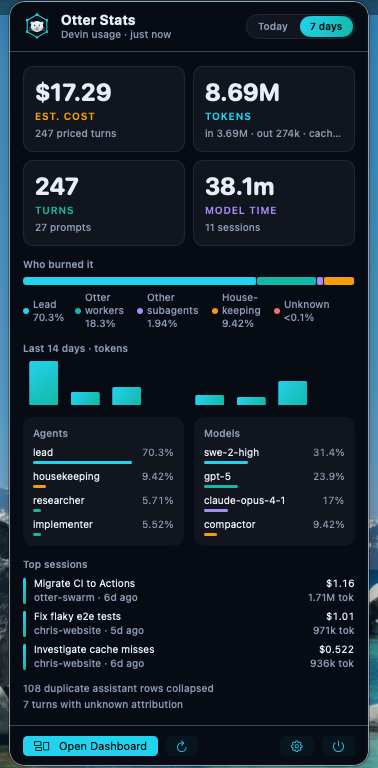
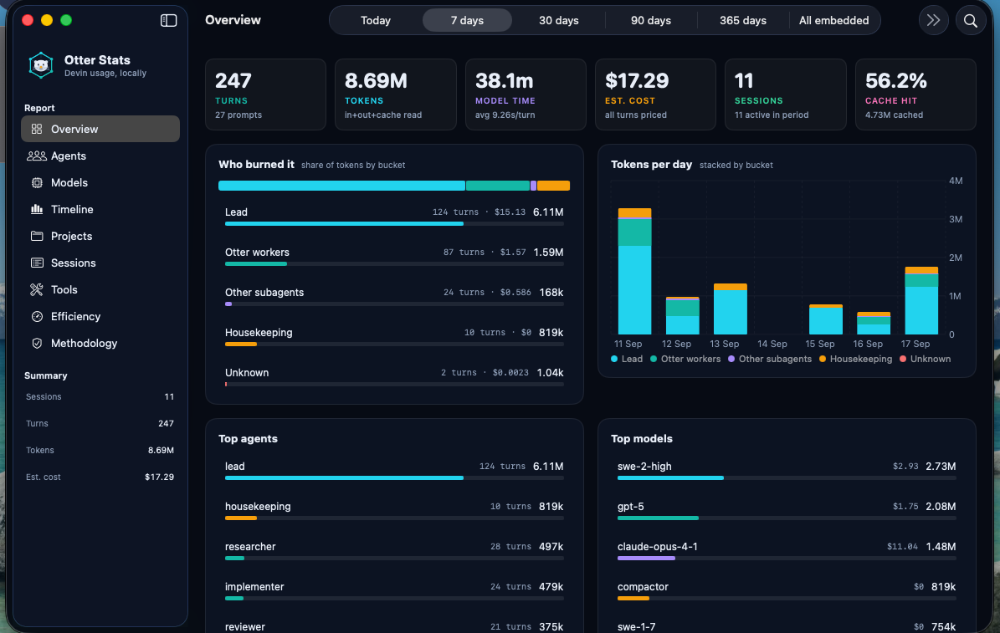

# Otter Stats

A native macOS menu bar app that shows what your Devin sessions burn — cost,
tokens, turns and model time per agent, model, project and session — straight
from the local Devin CLI / Desktop database. It is the usage side of
[Otter Swarm](https://github.com/chris-wozniczek/otter-swarm)'s
`/otter:stats report`, packaged as a standalone app for people who don't run the plugin.

Everything stays on your Mac. The sessions database is opened read-only and no
data ever leaves the machine.

<p align="center">
  
</p>

<p align="center">
  
</p>

## What you get

**Menu bar** — a live number in the bar (cost, tokens, turns or model time for
today / 7 days, your choice) and a compact popover with KPIs, the "who burned
it" share bar, a 14-day timeline, top agents, top models and top sessions.

**Dashboard** — the full Otter Swarm report as a native window:
Overview, Agents, Models, Timeline, Projects, Sessions, Tools, Efficiency and
Methodology. Period picker (today → all embedded), search, and click-to-filter
on any bucket, agent, model, project or session.

**Same numbers as `otter stats`** — attribution is structural (each assistant
turn is walked up the message tree to its root), duplicates are collapsed once,
pricing comes from the Otter Swarm price snapshot, and every data-quality
caveat (duplicates, unknown attribution, missing metrics, unpriced models,
truncation) is surfaced instead of hidden.

## Install

Requirements: macOS 14 (Sonoma) or newer. Devin CLI or Devin Desktop for real data.

Download `OtterStats.zip` from the latest release, unzip, drag
`OtterStats.app` to `/Applications`, open it. The otter appears in your menu bar.

Or build it yourself:

```sh
git clone https://github.com/chris-wozniczek/otter-stats.git
cd otter-stats
Scripts/build-app.sh --zip        # -> dist/OtterStats.app (universal, ad-hoc signed)
open dist/OtterStats.app
```

Set `CODESIGN_ID="Developer ID Application: …"` to sign with your own identity.

## Data sources

| What | Default | Override |
| --- | --- | --- |
| Sessions database | `~/.local/share/devin/cli/sessions.db` | `OTTER_SESSIONS_DB` or Settings |
| Price snapshot | `~/.config/devin/otter/prices.json` | `OTTER_PRICES_PATH` or Settings |
| Role pins (drift check) | `~/.config/devin/agents/<role>.md` | — |

The price snapshot is the same `otter-prices/1` file Otter Swarm writes.
If you don't have one, **Settings → Refresh prices** runs
`devin models list --format json` and writes it. Without prices, turns are
shown as unpriced and cost is marked `≥`.

The app watches the database for changes and refreshes automatically
(default every 60 s, configurable).

## Demo mode

No Devin database yet? Turn on **Settings → Demo mode** (or click
*Try demo data* in the popover). A deterministic synthetic database with
sessions, Otter roles, subagents, duplicates and orphan chains is generated in
`~/Library/Application Support/OtterStats/` so you can explore the UI.

## Development

```sh
swift build            # debug build
swift test             # OtterStatsCore unit tests
.build/debug/OtterStats
```

Layout:

```
Sources/OtterStatsCore   read-only SQLite reader, tree attribution, usage cube,
                         slicing/filters, prices, synthetic fixture generator
Sources/OtterStats       SwiftUI app: MenuBarExtra popover, dashboard window,
                         settings, Otter Swarm theme + logo
Tests/OtterStatsCoreTests
Scripts/build-app.sh     builds the .app bundle (universal binary, Info.plist, icon)
```

`OtterStatsCore` has no UI dependency and can be reused from a widget
extension or a CLI.

## Methodology

- A *turn* is one assistant `chat_message` row with usage metrics. Duplicate
  rows for the same message are collapsed once (count reported).
- *Lead* = `normal` / `plan` / `ask` profiles; *Otter workers* = planner,
  researcher, implementer, reviewer, tester, interrogator; other `subagent_*`
  profiles = *Other subagents*; summarizer / compactor = *Housekeeping*;
  turns whose chain can't be resolved = *Unknown*.
- Tokens = input + output + cache read. Cache writes are shown separately.
- Cost = per-turn tokens × price snapshot. It's a local estimate, never an invoice.

## License

MIT
